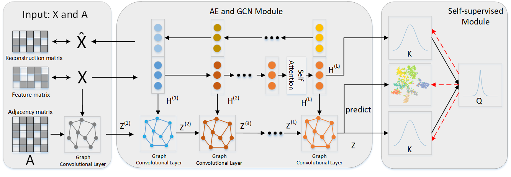

#AEGAN

### ABSTRACT
A Machine Learning Model to Attribute Network Community Detection
Attribute-based community detection plays a pivotal role in social 
network analysis. Recent advancements in machine learning, 
particularly in the domain of graph convolutional networks (GCNs), 
have emphasized the significance of incorporating both topological 
structure information and content information to accomplish this 
task. Nevertheless, existing models are afflicted with limitations such as restricted model depth and imbalanced information fusion. To address these deficiencies, this paper introduces a novel community detection model, denoted as AEGAN (Autoencoder-enhanced Graph Attention Network), 
which leverages the power of machine learning. 
In particular, our model combines a self-attention mechanism 
and an autoencoder to enhance the ability of GCNs in to extract 
node information, thus overcoming the limitation of shallow GCN 
layers. Additionally, we introduce a triple-supervised mechanism 
to adapt to unsupervised learning scenarios and closely resemble 
real community situations. Our research is situated at the 
intersection of machine learning and social network analysis, 
through a comparison with classical community detection methods, 
our model achieves significant improvements in evaluation metrics 
such as accuracy (ACC) and normalized mutual information (NMI), 
thereby validating the robustness of AEGAN.

### REQUIREMENTS

torch
pandas
numpy
munkres
scipy
scikit_learn

### MODEL

### DATASET
We provide preprocessed files for the Cora dataset, which can be directly used for running. You can also train your own models through 'data/pretrain.py'.

Due to file size limitations, the remaining datasets can be obtained through the following link.

链接：https://pan.baidu.com/s/1yoyNUPzMdqAPtn3M3m7U_Q 

提取码：0926
### USAGE
To run it, execute AEGAN/aegan.py. 

If you need to perform experiments again, follow these steps: 

(1) Upload the .txt file of the dataset, upload the edge set 
of the dataset, and upload the label set of the dataset. 
You can refer to the usage in data/construct.py. 

(2) Use data/pretrain.py to preprocess the dataset and obtain 
a .pkl file. 

(3) Modify the dataset name in AEGAN/aegan.py. 

(4) Run AEGAN/aegan.py.

Note: Because the k-means algorithm for obtaining community centers is stochastic, please run multiple experiments to obtain average results for assessing the model's performance.
